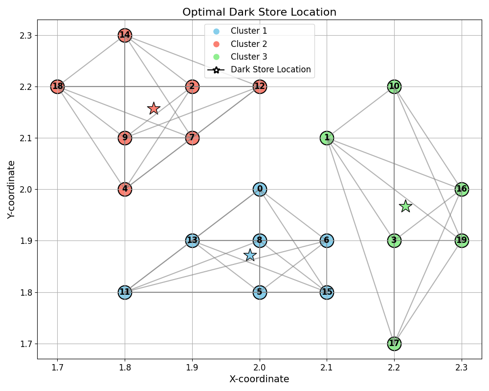
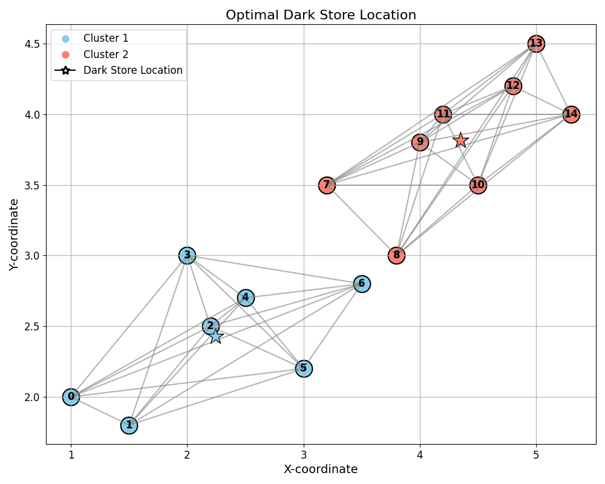

# Optimal Dark Store Location for Quick Commerce Companies

- The following repostitory contains the Pulp (Python Library) Code having implementation of the problem. We used Matplotlib for visual understanding as well.
- The images of some examples we ran are also present

